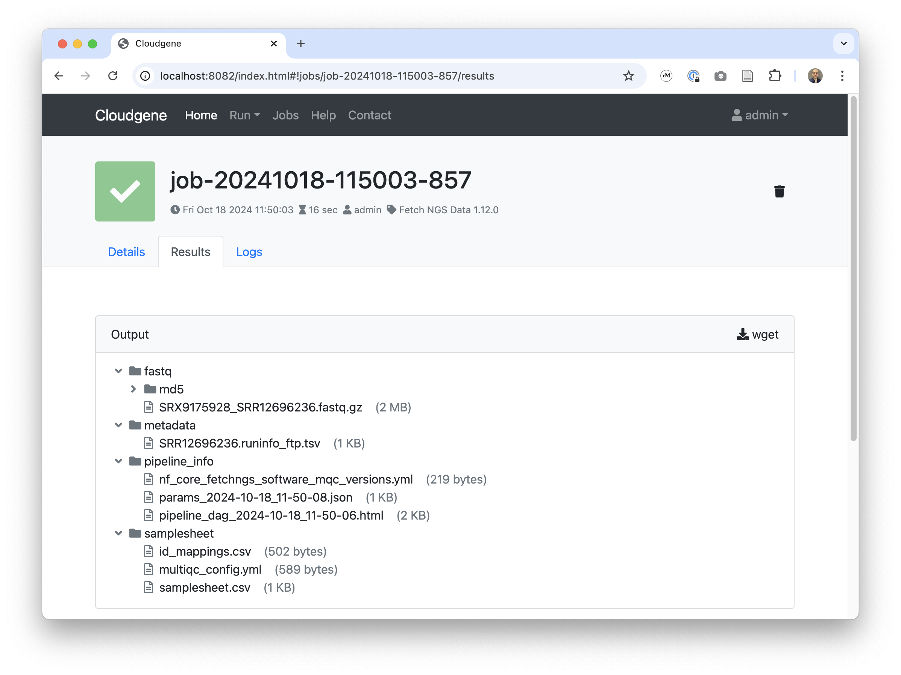

# Getting Started

This guide will help you start Cloudgene and install your first application. You must install Cloudgene properly on your computer before you can begin.

## Start the Cloudgene Server

The web server can be started with the following command:

```sh
./cloudgene server
```

The web service is available at [http://localhost:8082](http://localhost:8082). Please use the username `admin` and password `admin1978` to log in. The default port can be changed in the [configuration file](configuration.md#web-application).

## Install Your First Application

Stop the web service by pressing `CTRL-C`. The **cg-fetchngs** application can be installed using the following command:

```sh
./cloudgene install lukfor/cg-fetchngs
```

Next, restart Cloudgene with the following command:

```sh
./cloudgene server
```

Open Cloudgene in your browser and log in. A new menu item, **Run**, will appear in the menu bar. Click on it to start a new job:


The **cg-fetchngs** application starts the nf-core pipeline, downloads the entered IDs, and provides the results for download.



## What's Next?

- [Install additional applications](/server/install-apps)
- [Configure and customize Cloudgene](/server/configuration) to support email notifications and SSL certificates.
- Learn how to [manage permissions](/server/permissions) and [handle jobs](/daemon/jobs).
